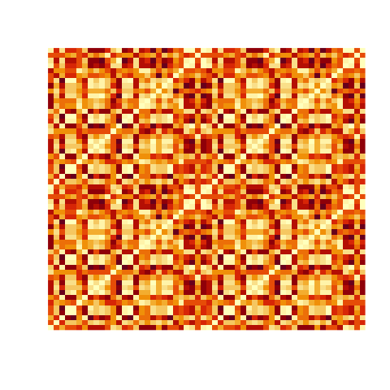
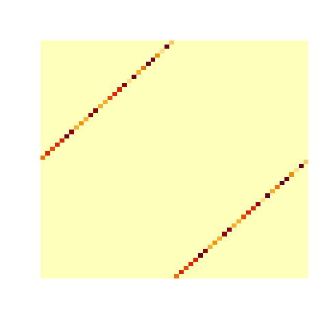

# Using a Distance Matrix to Match Location-level Data

### Tutorial Aims

#### <a href="#section1"> 1. What is a distance matrix and when to use it</a>

#### <a href="#section2"> 2. Creating a distance matrix</a>

#### <a href="#section3"> 3. Matching locations using the distance matrix</a>

#### <a href="#section4"> 4. Evaluating and improving your matches</a>

#### <a href="#section5"> 5. Challenge</a>


## Introduction
This tutorial is designed to teach you how to match location-level data using a distance matrix. As we have learned in this class, data scientists are often faced with using messy, poorly structured, or difficult-to-work-with data. It is rare when working with data sets pulled from multiple sources that they will smoothly integrate with each other, without any effort from the data scientist. This is especially true with location-level data. A major problem that faces people working with location-level data is the impermanence of place names. Names of towns or cities can vary greatly across data sources since the names can change overtime (a common occurence for smaller towns) or there can be variations in the spelling. For instance, a town written as 'Foxborough' in one data source can be written as 'Foxboro' in another. This tutorial will show you one solution to this problem, which uses a distance matrix to match towns across data sets regardless of town name.

All of the data used for this tutorial can be found in the `practice_data` folder linked [here](https://github.com/EdDataScienceEES/tutorial-mpskelton/tree/master/data/practice_data).

<a name="section1"></a>

## 1. What is a distance matrix and when to use it
A distance matrix can be very useful for solving the problem of changing place names when a specific, but not uncommon, condition is met. In order to use a distance matrix, both data sets will need to have coordinates attached to the locations. Similar to how the names of places change, the coordinates used to denote a place will not be the same across all data sets since there can be some ambiguity as to whether the coordinates identify the exact centre of the location or another point of significance. 

The distance matrix that we will make in this tutorial is a matrix that calculates the distance between every two locations in a given set at reports the resulting values in matrix form. The matrix will always be a symmetric matrix since the list of locations that corresponds to the rows is the same list that corresponds to the columns. The matrix can be made using the `R` package `geosphere`, which among other features contains the function `distm()` that creates the matrix from a data frame consisting of a list of locations, each with a latitude and longitude.

Here is a diagram showing what a distance matrix looks like and what it represents.

<p align="center">
  
</p>

You can see in the diagram that the distance matrix will always be symmetrical since it calculates the distance between, for example, points A and B as well as the distance between B and A, which will result in the same value. You can also see that the diagonal across the matrix will always have values of zero since the distance between points A and A or B and B should always be zero. The function that we will be using calculates distances using the distance formula visualized in the diagram below.

<p align="center">
  
</p>

Now, let's take a look at the data we will be working with today to see how we can utilize this function and achieve our goal of matching location names.

```r
# Set the working directory
setwd("your_filepath")

# install packages
install.packages("geosphere")
install.packages("stringdist")

# Load packages
library(tidyverse)
library(geosphere)
library(stringr)

# load in example data sets
placeid <- read.csv("data/practice_data/placeid_coords.csv")

placecat <- read.csv("data/practice_data/placecat_coords.csv")

# summaries
str(placeid)
head(placeid)

str(placecat)
head(placecat)
```

In addition to looking at the structure and summaries of the data sets you're working with, it's always a good idea to also print the first few lines from data sets to get an understanding of what it looks like. A benefit to using the function `head()` rather than just opening the data frame in `R` is that it can save time, as large data frames may take a while to load.

```
> head(placeid)
  Place.ID               Place.Name        Lon        Lat
1        1        Flourish & Blotts  -13.79473 -57.846938
2        2 Gringotts Wizarding Bank   83.93589 -64.559393
3        3          Knockturn Alley   59.53600   9.019405
4        4              Ollivanders  159.69376 -51.882184
5        5       The Leaky Cauldron  -65.45402  45.191386
6        6 Weasleys' Wizard Wheezes -150.63995 -55.896534

> head(placecat)
                Place.Name Place.Category        Lon        Lat
1      Flourish and Blotts   Diagon Alley  -13.78872 -57.845460
2 Gringotts Wizarding Bank   Diagon Alley   83.94190 -64.557915
3          Knockturn Alley   Diagon Alley   59.54201   9.020883
4              Ollivanders   Diagon Alley  159.69976 -51.880706
5           Leaky Cauldron   Diagon Alley  -65.44801  45.192864
6  Weasleys Wizard Wheezes   Diagon Alley -150.63394 -55.895056
```

Let's say we are interested in matching `Place.ID` with `Place.Category` because the ID variable works well with another data set we are using (maybe a person-level data set) and we want to group people by `Place.Category`. In this case we would need to merge these two data frames. However, after looking at the data, we can see that the place names from this data set don't exactly match up. For instance, in one data set `The Leaky Cauldron` is written as `Leaky Cauldron` and in another `Weasleys' Wizard Wheezes` is missing the apostrophe. These may not seem like major differences, but it if the names do not match exactly, then `R` won't be able to join these data frames using that column. We can try running a merge function like `inner_join`, which takes two data frames and a column name as arguments and then outputs a data frame that consists of rows that matched by the given column.

```
place_perfmatch <- inner_join(placeid, placecat, by = "Place.Name") %>% 
                   rename(Lon_id = Lon.x) %>% 
                   rename(Lat_id = Lat.x) %>%
                   rename(Lon_cat = Lon.y) %>%
                   rename(Lat_cat = Lat.y)
```

The new data frame `place_perfmatch` only has 46 observations, while the data frames we tried to merge both have 74 observations. From here we can tell that these minor differences in name spelling prevented 28 rows from matching. This is where the distance matrix can come in handy. We don't need to make a matrix using all 74 locations since 46 were able to match well, but we should use a matrix for the remaining 28 unmatched locations. __Note: It is better to filter out the locations that were able to match by name alone since having a smaller matrix will improve efficiency. This is especially true when you are working with data sets that have hundreds or thousands of towns rather than just 74 locations.__

<a name="section2"></a>

## 2. Creating a distance matrix

The data frame that we will be passing along to the matrix command `distm` should include all of the rows from both data frames that could not match by name alone. To do this, first subset both data frames to only include the rows that do not match, then bind these two data frames.

```
# make a data set of the unmatched places
nomatch_id <- subset(placeid, !(placeid$Place.Name %in% place_perfmatch$Place.Name))
nomatch_cat <- subset(placecat, !(placecat$Place.Name %in% place_perfmatch$Place.Name))

nomatch <- bind_rows(nomatch_id, nomatch_cat)
```

The next step is to cut the data frame down to just the columns that the function will use. This is a pro and a con of this specific function. It is very easy and simple to make the distance matrix, but the simplicity creates some limitations. For instance, it is important that your data frame only includes two columns (longitude and latitude) and that they are in the correct order, where longitude is the first column and latitude is the second.

```
# make a data frame that just has the lat and lon columns
matrixmatch <- select(nomatch, Lon, Lat)
```

Once we make this data frame, we can create the distance matrix. And it only takes one line of code to make it!

```
# make the distance matrix using the distm function
distmatrix <- distm(matrixmatch, fun=distGeo)
```

Once you make it, open it up in `R` to see how the matrix looks! It should like a bunch of cells of numbers. I included a screenshot below of what a portion of it should look like. 

<p align="center">
  
</p>

Let's break down what all of these numbers mean and check our understanding. The command `distm` took every set of coordinates (every row) and calculated the distance with every other row. That is why we see zeroes going diagonally down the matrix because at these points the distance was calculated between a set of coordinates and itself. Most of these distances (which are calculated in meters by default) are very large. This is because the data has coordinates from anywhere in the world (not truly reflective of the Harry Potter World). However, somewhere in this mess, are relatively small distances. These small distances suggest two rows had coordinates very close to each other. These points are our best candidates for matches since (as I mentioned above) data sets can have different coordinates for the same place, but they should be similar.

Another fun way to visualize matrices, aside from looking at them in `R` is to output them as pixel images, by running the line `image(m, useRaster=TRUE, axes=FALSE)`, where `m` is your matrix. This can sometimes be helpful when looking for patterns in a matrix, or when creating visuals for a report, as there are ways to customize it. It won't be incredibly helpful with this matrix since we still have some cleaning to do, but it does look beautiful.

<p align="center">
  
</p>

<a name="section3"></a>

## 3. Matching locations using the distance matrix

Now that we have the matrix created, we get to the hard part: using the matrix to match the locations that are meant to match by name by can't.

The easiest way to identify the small distances is by turning every value that is above a threshold we decide ourselves to be equal to zero. In the code below, I use a threshold of 1400 m, which is roughly 0.86 mi. In my experience, this distance is usually large enough to get good matches. However, depending on your data, you may want to use larger or smaller values. If you are working with data on towns clustered around one region then you may need to use a smaller threshold since many towns may be within a mile of each other from the start. However, if you are working with data on regions then you may need to use a larger threshold as the coordinates for the center of the region may vary by more than a mile.

```
# The matrix computes distances in meters by default
# set all values in the matrix that are greater than 1400 m (or roughly 0.86 mi) to zero
distmatrix[distmatrix > 1400] <- 0
```

We can turn the matrix into a pixel image again, after filtering out the very large distances. In this image, the pattern is easier to see, as the only pixels with color represent the locations that have non-zero distances of less than 1400 m. 
These matrix images also really help visualize the symmetry of distance matrices.

<p align="center">
  
</p>

Now, the next chunk of code is a bit tricky since there are a lot of moving parts.

What we want to do next is convert the distance matrix into a data frame so that we can start manipulating it since, after all, it is not very helpful to just have a bunch of zeroes with some numbers scattered throughout it. After that, we want to replace the remaining distance values with the name of the column they are in. The columns (which are called V1, V2, ..., V56) each match up with a town in our `nomatch` data frame. For instance, the column V1 would correspond to the first town in the `nomatch` data frame and so on. By replacing the distance values with the column names we will later be able to match the distances to the two locations from `nomatch`.

Next we want to create a data frame that has just two columns, the index for one town, and the index for the town it was relatively close to. I complete this step using a for loop. (For more on for loops check out the coding club tutorial on [functional coding](https://ourcodingclub.github.io/tutorials/funandloops/index.html)!) What the for loop does is take a slice of the first row of the matrix, save the name of the non-zero value (the column name), turn this into a data frame, bind it to the empty data frame `col_match` which will eventually be populated by every row of the matrix. You can see that there is another for loop inside this for loop. This nested loop is used to name the columns of the data frame we are trying to build. It is here just in case there are multiple matches (which will sometimes happen). Multiple matches usually mean that you need to change your distance threshold. Otherwise, keep the multiple matches through to the step where we attach the place names back to these column names and then you can decide which of the locations it matched to is meant to be the same location.

```
# turn the matrix into a data frame
distmatrix_df <- as.data.frame(distmatrix)

# saves location of every remaining non-zero value in the matrix
mat <- which(distmatrix_df[-57] > 0, arr.ind = TRUE)

# sets the values of the non-zero values to be the name of the column
distmatrix_df[-57][mat] <- names(distmatrix_df)[-57][mat[, 2]]

# Creates an empty data frame for the loop
col_match <- data.frame()

# a for loop that compiles all of the remaining matches from the matrix
for(i in 1:length(distmatrix_df)){
  temp_row <- slice(distmatrix_df, i)                  # take the ith row from the matrix df
  
  temp_row <-  temp_row[, colSums(temp_row != 0) > 0]  # saves the name of the nonzero value (which is the column name)
  
  temp_row <- as.data.frame(temp_row)                  # turns it back into a dataframe
  
  # a nested for loop that names the 
  for(k in 0:ncol(temp_row)){                          # iterate over the number of columns in temp row
                                                       # ideally there is only one column, the for loop is in case there are more than one
    colnames(temp_row)[k] <- paste0("C", k)            # name the columns to be C1, C2, etc
    
  }
  
  temp_row$ownname <- paste0("V", i)                   # Creates a new column that includes it's original position in the matrix
  
  col_match <- bind_rows(col_match, temp_row)
  
  rm(temp_row)
}

# bring ownname column to front (for simplicity)
col_match <- relocate(col_match, ownname)
```

Our next step is to reattach the location names that get lost when creating the distance matrix. I do this by creating a new data frame called `labels` that contains the 'vlables' for the place names. What I call 'vlabels' are the default column names made by the matrix (V1 through V56, in this case). As mentioned above, the number of the column indicates which place it corresponds to in our `nomatch` data frame, so the `labels` data frame essentially just takes the list of towns from `nomatch` and creates its 'vlabel'. Once we have the `labels` data frame made, the next step is to merge on the town names and make a new data frame called `new_matches`. This data frame will have all of the places in the column called `Place.Name_own` and all of the locations that were very close according to the matrix in the column called `Place.Name_match`. You will notice that this data frame has every town location name twice. This is because if place A matches with place B then place B will match with place A. This problem is resolved later on, however.

```
# just keep all of the place names from the unmatched list of locations
labels <- select(nomatch, Place.Name)

# create a column that includes 'vlabels' or labels that follow the same patter as the matrix matches
labels$vlabel <- paste0("V", seq.int(nrow(labels)))

# create a new matches data frame that joins on the names of the locations and removes the matrix 'vlables'
new_matches <- left_join(col_match, labels, by = c("ownname" = "vlabel")) %>% 
               rename(Place.Name_own = Place.Name) %>% 
               left_join(., labels, by = c("C1" = "vlabel")) %>% 
               rename(., Place.Name_match = Place.Name) %>% 
               select(Place.Name_own, Place.Name_match)
```

<a name="section4"></a>

## 4. Evaluating and improving your matches

The next step is evaluating our matches, and if we are satisfied, merging on the data to create our final data set.

One good way to evaluate the matches made by the distance matrix is by calculating string distances, using the package `stringdist` which has the function `stringdist`. This function calculates how far the strings (place names) are from their matches. 

```
# create a string distance variable 
new_matches$strdist <- stringdist(new_matches$Place.Name_own, new_matches$Place.Name_match, method = "jw")
```

The screenshot below shows what this data frame should look like. Remember that lower string distances indicated the strings are more similar.

<p align="center">
  
</p>

You'll notice that one of the arguments for this function is `method` which asks which type of string distance calculation method you would like to employ. I use the Jaro-Winkler method (`jw`) which essentially cuts up strings into two character segments and then calculates the similarity of the sets of two character segments. Calculating string distances is an easy way to quantitatively assess matches, however, it is not perfect. For shorter words, like 'Quad' will have a high string distance when it is matched with 'The Quad' because roughly have of the string is missing, even though we can see that these strings should match well.

In the case of this data set, you do not need to worry about poor string distances since every location has a definite match, but keep in mind that this will not always be the case. Sometimes you will have unbalanced data sets (where one has more places than the other) and you may not be sure that every location has a match, so string distances can come in handy.

The next step is to merge on the data to these new matches and then create the final data set. 

```
# rename Lat/Lon vars across dfs to distinguish them when merging
placeid <- placeid %>% 
           rename(Lat_id = Lat) %>% 
           rename(Lon_id = Lon)

placecat <- placecat %>% 
            rename(Lat_cat = Lat) %>% 
            rename(Lon_cat = Lon)

place_newmatch <- left_join(new_matches, placeid, by = c("Place.Name_own" = "Place.Name")) %>% 
                  left_join(., placecat, by = c("Place.Name_match" = "Place.Name")) %>%
                  filter(!is.na(Place.ID)) %>% 
                  rename(Place.Name = Place.Name_own)
                  
# bind together the new matches with the perfect matches from before
place_full <- bind_rows(place_perfmatch, place_newmatch)
```

Well done! You have successfully merged the two data sets! 

Just to recap, using the distance matrix in this way is useful when using location-level data that has variance in location names. It may sound like a niche problem, but place names and spelling is quite variable in the real world. And it is a handy way to match locations, especially since the alternative is manually sifting through all of the names and manually correcting your data sets. In some cases, there may be some manual work involved but this method can certainly help cut down the amount of manual work you will have to do.

Now check out the challenge below! The challenge tries to simulate a more real-world application that simulates some of the hiccups you may encounter when using distance matrices.

Also check out the further reading section for more on string distances, matrices, and info on the two new packages introduced in this tutorial `geosphere` and `stringdist`!

Thank you for your patience and attention! And good luck coding!

<a name="section5"></a>

## 5. Challenge!
This challenge uses data on US Cities from Simple Maps. The original data can be found at [https://simplemaps.com/data/us-zips](https://simplemaps.com/data/us-zips).

For this challenge, you will be looking at Massachusetts towns. The data sets necessary for this challenge can be found in the challenge folder linked [here](https://github.com/EdDataScienceEES/tutorial-mpskelton/tree/master/challenge). The folder includes two files, `mass_cities1.csv` and `mass_cities2.csv`, one file has county info on the Massachusetts towns and the other file has population data. Your challenge is to merge these two files into one data frame that has both county info and population data for each listed town. You will find that there are some problems in how the names are spelled across the two files, so you will need to create a distance matrix to match the towns that are spelled differently. However, you may encounter some other problems with the town names that won't be solved completely by the distance matrix. As mentioned before, distance matrices are very helpful but sometimes some extra research is still required (__Hint: Town names change over time, so the same town might have a different name entirely__).

If you get stuck, there is an answer key script in the folder that shows all of the steps necessary to get to the final product.

## Further Reading
Read more on distance matrices [here](https://www.displayr.com/what-is-a-distance-matrix/).

Read more on `geosphere` [here](https://cran.r-project.org/web/packages/geosphere/geosphere.pdf).

Read more on `stringdist` [here](https://cran.r-project.org/web/packages/stringdist/stringdist.pdf).

Read more on string distances [here](https://www.baeldung.com/cs/string-similarity-edit-distance).

<hr>
<hr>

#### References
__Simple Maps Data:__ [https://simplemaps.com/data/us-cities](https://simplemaps.com/data/us-cities)

__Harry Potter Data:__ [https://www.kaggle.com/datasets/maricinnamon/harry-potter-movies-dataset?resource=download](https://www.kaggle.com/datasets/maricinnamon/harry-potter-movies-dataset?resource=download)

__Distance Matrix Image:__ [https://commons.wikimedia.org/wiki/File:Additive_distance_matrix.png](https://commons.wikimedia.org/wiki/File:Additive_distance_matrix.png)

Reference: IvanMontoya, CC BY-SA 4.0 <https://creativecommons.org/licenses/by-sa/4.0>, via Wikimedia Commons

__Distance Formula Diagram:__ [https://commons.wikimedia.org/wiki/File:Euclidean_distance_2d.svg](https://commons.wikimedia.org/wiki/File:Euclidean_distance_2d.svg)

Reference: Kmhkmh, CC BY 4.0 <https://creativecommons.org/licenses/by/4.0>, via Wikimedia Commons
